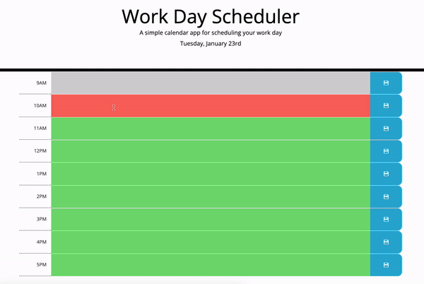

# Daily Planner App

The Daily Planner App is a simple and intuitive tool designed to help you organize and schedule your workday efficiently. This app provides a user-friendly interface to keep you on track by dividing your day into specific time blocks.

## Features

- Displays the current day at the top of the calendar.
- Present time blocks for standard business hours.
- Color-code each time block based on past, present, and future when the time block is viewed.
- Allow a user to enter an event when they click a time block.
- Save the event in local storage when the save button is clicked in that time block.
- Persist events between refreshes of a page.
- Clear events

## Technologies Used

- **Frontend:** HTML, CSS, Bootstrap and JavaScript
- **Libraries** Day.js, jQuery with jQuery UI
- **Version Control:** Git

## Screenshot

## Link to Project

The live version of this project can be found [here](https://caseygirlyn.github.io/Daily-Planner-App/).

## License

This project is licensed under the [MIT License](LICENSE).